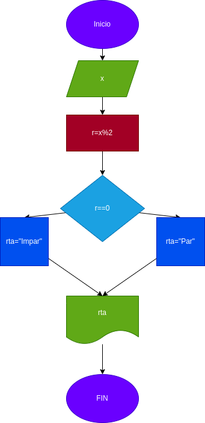

# Par o impar
Programa para verificar si un numero es par o impar.

## Calcular el moduolo mediante un numero dado.

# Analisis

-Variable de entrada

X: Es igual a un numero natural, para desarrollar el ejercicio dado

-Variable de salida

# Diseño
 

# Contruccion

ejercicio N.4 implementar programa para saber si un numero es par o impar

r:x%2

## ESTE PROGRAMA ESTA ESCRITO EN LENGUAJE MARKDOWN